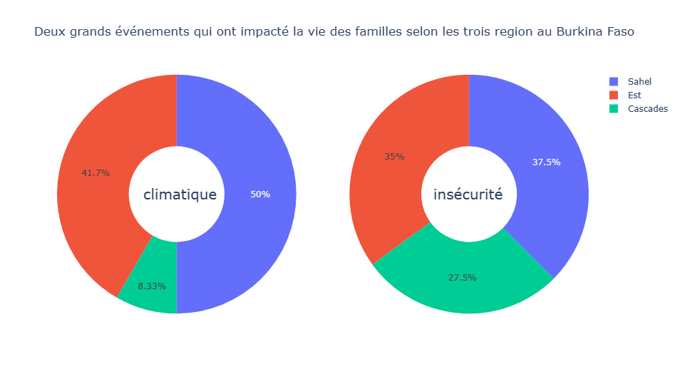
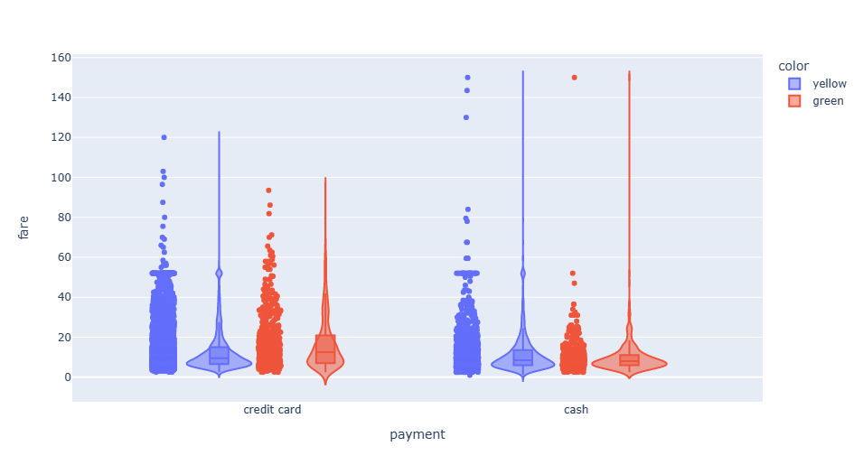
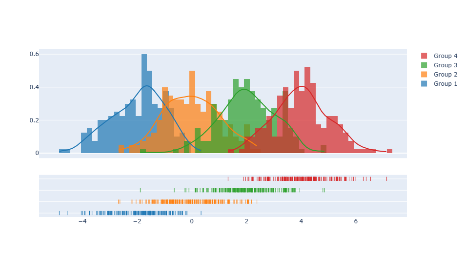
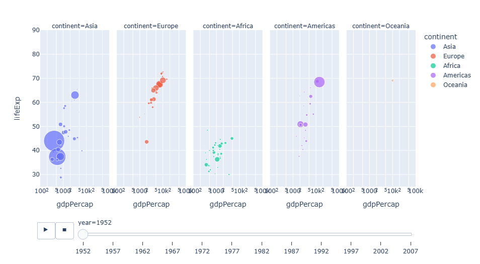
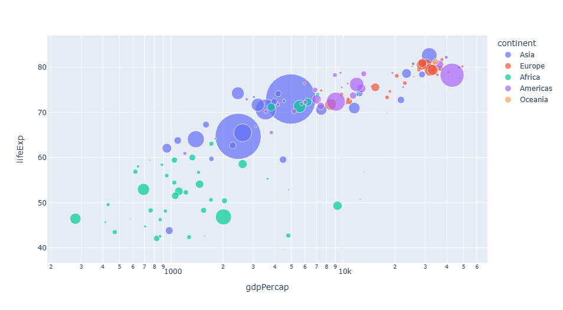
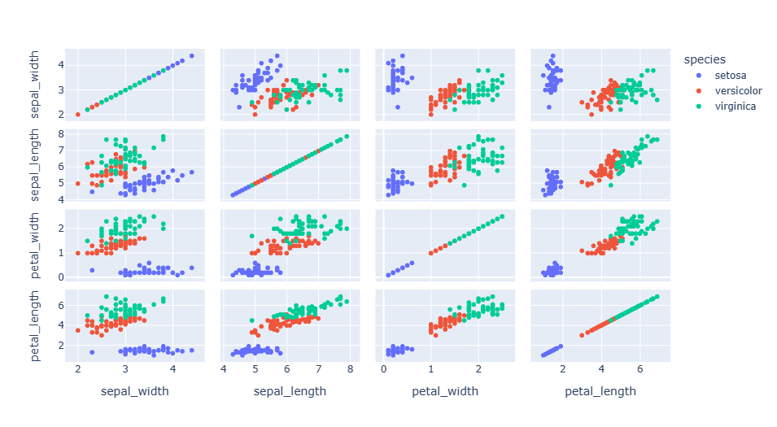

# Projet : Library  plotly 

# Plan du projet 
1. <a href="#introduction" target="_blank">Introduction</a> 

2. <a href="#the-basic-notions-of-descriptive-statistics" target="_blank">The basic notions of descriptive statistics</a>

    <a href="#character" target="_blank">2.1 Character</a>
    
     <a href="#qualitative-character" target="_blank">2.2 Qualitative character</a>
     
     <a href="#categorical-variable" target="_blank">2.3 Categorical variable</a>
     
     <a href="#quantitative-character" target="_blank">2.4 Quantitative character</a>
     
     <a href="#quantitative-variable" target="_blank">2.5 Quantitative variable</a>
     
     <a href="#univariate-graph" target="_blank">2.6 Univariate graph</a>
     
     <a href="#multivariate-graph" target="_blank">2.7 Multivariate graph</a>
 3. [Application with the library plotly](#application-with-the-library-plotly)

    <a href="#pie chart" target="_blank">3.1 Pie chart</a>
    
    [3.2 Boxplot graph or moustache box](#boxplot-graph-or-moustache-box)
    
    [3.3 Combined histogram and density graphing](#combined-histogram-and-density-graphing)
    
    [3.4 Dynamic graphical representation of scatterplot](#dynamic-graphical-representation-of-scatterplot)
    
    [3.5 Correlation matrix using scatterplots](#correlation-matrix-using-scatterplots) 
    
4. [Conclusion](#conclusion)

   
   

# Introduction  

After having obtained a sample or counted a population, one usually has a large volume of data. In order to get the maximum of information, it is more interesting to use a graphical representation of these data. Statistics is a field in which the study of data science needs graphical representations for exploratory analysis. To do this, we must first know the type of data to be studied. It is simply a question of knowing the nature of the data (studied characters) which can be of several types. Depending on the type of character, the graphic representation is different and libraries already exist to facilitate their representation. Like other libraries dedicated to the graphical representation, in this article we are interested in the plotly library. This library is much more improved to make graphical visualization. To carry out this project we will review the basic notions of descriptive statistics.

## The basic notions of descriptive statistics
##  Character
it is what the statistical study is about.
Example: the sex, the height, the color 
## Qualitative character
its observation cannot be measured
Example: nationality, the sex etc
## Categorical variable
categorical variable (deduced from the character): the measurement of the observation cannot be translated into a numerical value.
If the characer studied is nationality, the variables are for example:  
Benin, Burkina Faso, cote d'ivoire ,Senegal , etc...

The types of graphs that are appropriate are: 
Baton chart, pie chart etc

## Quantitative character
its observation can be measured
Example: age, height etc

## Quantitative variable 
Quantitative variable (deduced from the character): the measurement of the observation can be translated by a numerical value
If the studied character is the age, the variables are for example: 12 years, 14 years, 7 years, 2 years, 30 years etc..

The types of graphs used are: histogram, density , bar chart, 
box plot, time series (for continuous data)

Note that the boxplot can be applied when we cross a numerical variable with a categorical variable.

## Univariate graph
When we make a univariate representation, we are interested in the graphical representation of a variable.

## Multivariate graph
we study the variables two by two. 
The types of graphs used are : the scatter plot between two numerical variables,
the correlation matrix between two numerical variables, the graphs in PCA, ACM, AFC etc.

# Application with the library plotly
## Pie chart
This type of diagram allows the percentage distribution for each category of variable.
Here we use data from an anonymous source to highlight the two major events that 
the two major events that have disrupted the lives of families in three regions of Burkina Faso.

## lien for the souce code

## Boxplot graph or moustache box 
The boxplot is a way to represent the repartition of data in relation to the median. 
this part deals with the boxplot graphical representation of the means of payment according to the type of cab borrowed. these data are found in the seaborne library of python.


 
 ```python
import plotly.express as px

fig = px.violin(datataxi, y =datataxi['fare'], x = datataxi['payment'],color =datataxi['color'],
    box=True, points="all", hover_data=datataxi.columns)
fig.show()
```


# Combined histogram and density graphing 
 
A histogram is a way to represent the dipersion of the data with respect to a central value which is the mean
We will use 4 randomly simulated variables to make the graphical representation


## *lien for the souce code

## Dynamic graphical representation of scatterplot 
Nous allons utiliser le jeu de donnée gapminder contenu dans la librairie plotly
Ce jeu de données inclut l’espérance de vie (lifeExp), la population (pop) et le PIB par habitant (gdpPercap) sur 12 années (aux 5 ans entre 1952 et 2007)




```python
import plotly.express as px
df = px.data.gapminder()
fig = px.scatter(df, x="gdpPercap", y="lifeExp", animation_frame="year", animation_group="country",
           size="pop", color="continent", hover_name="country", facet_col="continent",
           log_x=True, size_max=45, range_x=[100,100000], range_y=[25,90])
fig.show()
```

```python
df = px.data.gapminder()

fig = px.scatter(df.query("year==2007"), x="gdpPercap", y="lifeExp",
         size="pop", color="continent",
                 hover_name="country", log_x=True, size_max=60)

fig.show()
```


## Correlation matrix using scatterplots  
For the scatterplot matrix we will use the *iris* dataset
iris dataset which is composed of 5 variables: -*Sepal.Length* - *Sepal.Width* - *Petal.Length* - *Petal.Width* - *Species*. The first four are continuous numerical variables, and the fifth is a categorical variable with 3 modalities (*setosa* /*versicolor* / *virginica*)



## *lien for the souce code

## Conclusion
The objective was to represent graphs on data with the Plotly library. This library allowed us to make circular graphs, boxplots. Then we made a simulation of variables to make histograms and density curves. Finally the library allowed us to make scatterplots and a correlation matrix